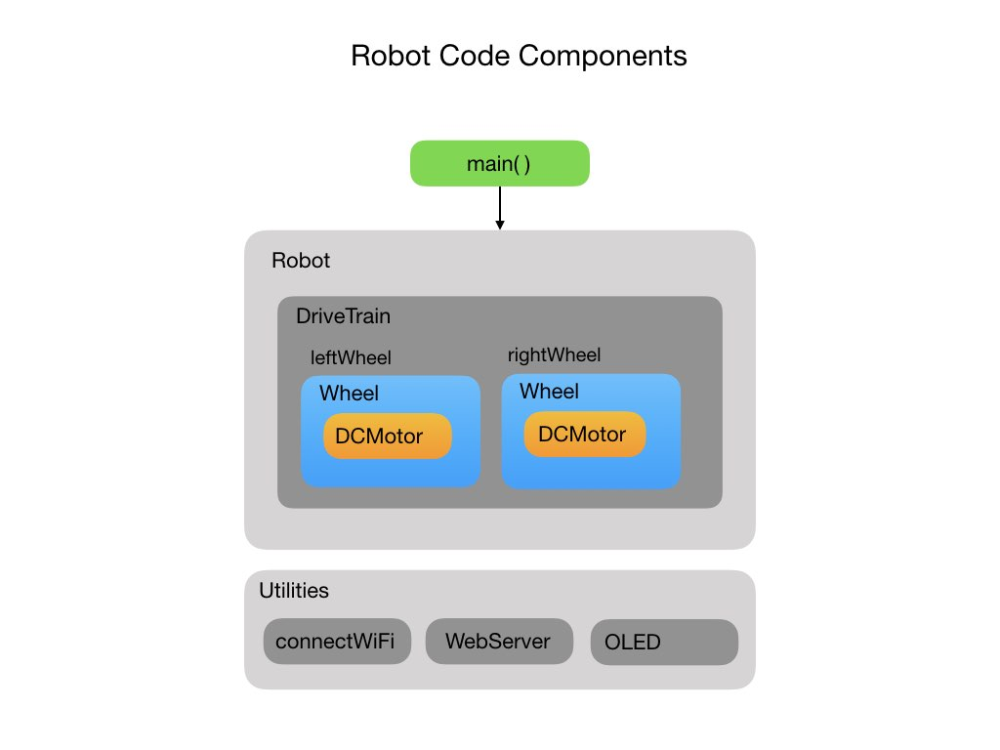

# Training Robot for FRC Programming Teams
This code is designed to be used as a teaching tool for programming teams involved in the <i>First Robotics Competition</i>.  FRCRobot is the introductory level code and should be installed first to begin the course. This introductory level code creates the basic structure of the robot that will be used throughout the course of training. Each level will build on this basic structure to add more functionality. 

The code is installed on a small Arduino based training robot.  The Bill-of-Materials and construction of this robot is described below.

- [Development Environment Setup](#ide)
- [Code Description](#code)

# Development Environment Setup
The code must be run on an ESP32 NodeMCU development board, which is an embedded Arduino based microcontroller with built-in WiFi.  For the development environment (IDE) we'll be using VSCode.  This is the IDE most commonly used by <i>First Robotics</i> teams.  In order to install code onto the ESP32 microcontoller you have to install the PlatformIO plugin for VSCode. The PlatformIO plugin install is explained in this [YouTube video](https://www.youtube.com/watch?v=5edPOlQQKmo)

Once you have the PlatformIO plugin installed the FRCRobot code can be cloned from Github following these instructions:
- From VSCode go to `View->Command Palette`.
- Type in `git clone` ,which will bring up a text box.
- Put in https://github.com/mjwhite8119/FRCRobot1.git and press enter.
- You'll then be prompted to enter a directory location on your local machine in which to store the project.
- Finally, open the project in VSCode.

Open a terminal and type the command:

 `platformio run -vv -e esp32dev -t uploadfs`
 
This is required to load the HTML and CSS files into the ESP32 SPIFFS file system. 

# Code Description
A diagram of the major code components for FRCRobot1 is shown below. The main program unit calls utility functions to connect to WiFi and bring up a Web Server on it's IP address.  The IP address and WiFi connection status is shown on an OLED display.  The Web Server is used to interact with the robot.

The main program creates a <i>Robot</i> class that is composed of a <i>DriveTrain</i> with a left and right <i>Wheel</i>.  Each wheel has it's own <i>DCMotor</i>.  This sets up a differential drive configuration for the robot.

This first program implements some very basic functionality.  You can move the robot forward and backward, and have it turn left or right. Because two motors are never the same the robot will most likely not move in a straight line.  This can only be solved by using wheel encoders and a PID loop. This will be implemented in the next code levels.
