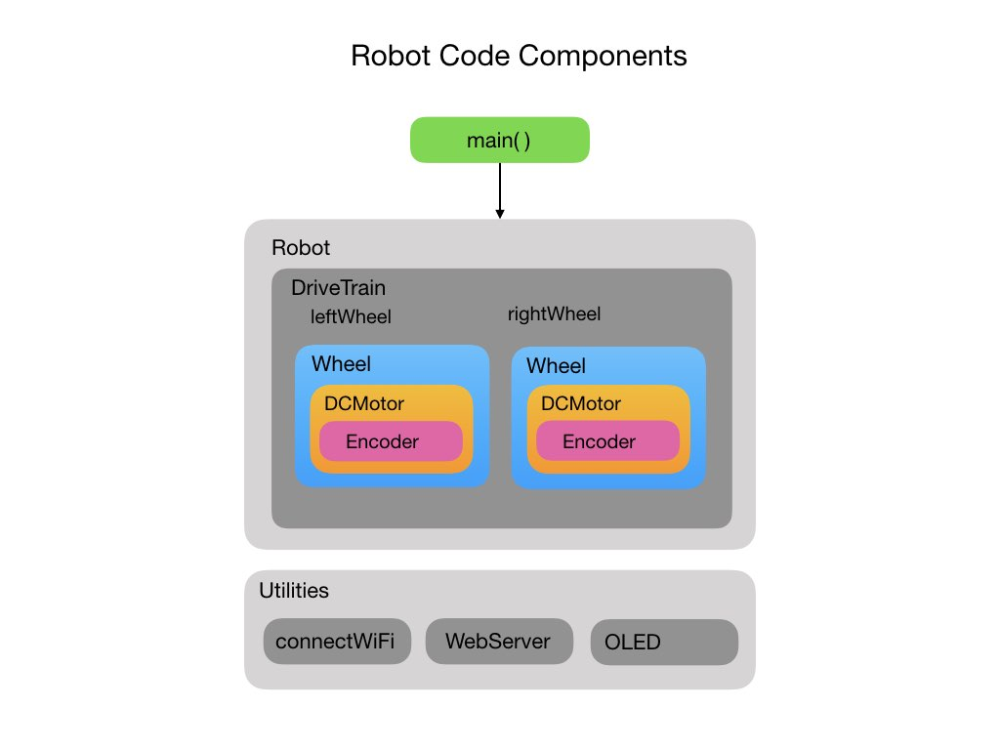
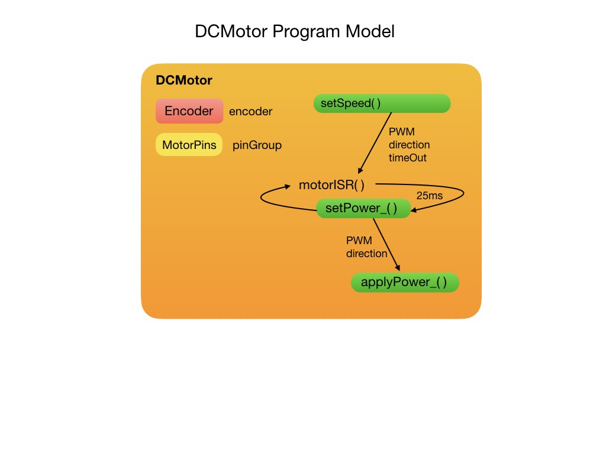
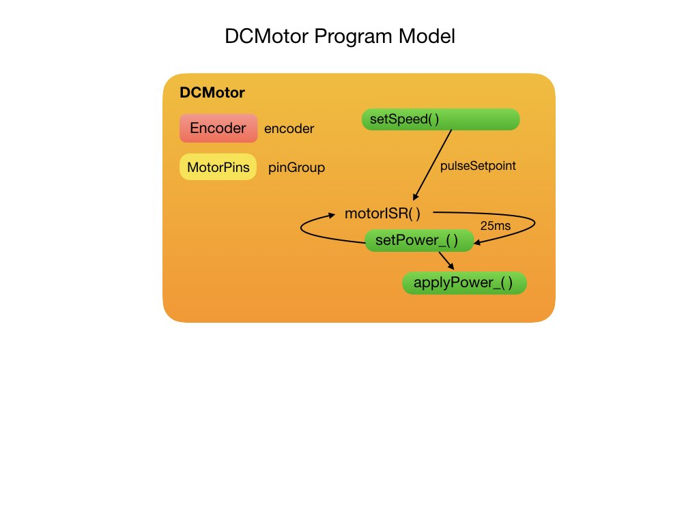

## Adding Wheel Encoders
In <i>FRCRobot-lesson-3</i> we will learn about two major topics in robotics programming, encoders and interrupts. This version adds wheel encoders to the project. In order to do this we will have to learn about both external interrupts and timer interrupts.

Encoders allow us to measure how fast the wheels are turning. This can be used to calculate the distance that the robot moves. An explaination of wheel encoders can be found in these videos:
- [Tracking Raspberry Pi Robot's Distance with Encoders](https://www.youtube.com/watch?v=cLtMcqRetO0)
- [How to use a LM393 IR Speed sensor with an Arduino](https://www.youtube.com/watch?v=9848QETGd_k&t=666s)

For our robot an encoder is attached to each motor.  This extends the programming structure of the robot as shown in the following diagram.

Explaination of external interrupts.

Diagram of <i>Encoder</i> class:

Explaination of timer interrupts.

Diagram of <i>DCMotor</i> class:

Finally, the <i>DriveTrain</i> model has changed to accept 
<h3>
<a href="code2">Previous</a>

<a href="code4">Next</a></h3>