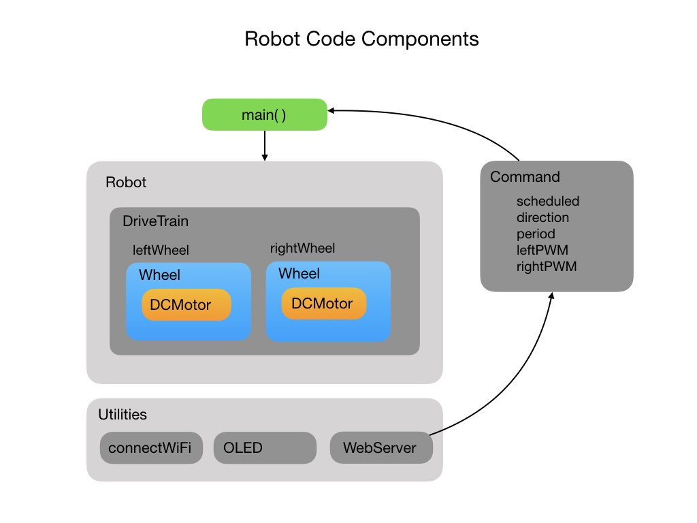

 ## Controlling Motor PWM using Commands
The first code version moves the robot at a set speed for a specified period of time. What we'll do in lesson2 is control the speed of the robot using <i>Pulse Width Modulation</i> (PWM) signals. This lesson also adds in the <i>Command</i> class.  This class takes command requests received from the website controller and manages their execution.

For the next few lessons we'll only implement linear motion (forward and backward).  Angular motion (turning) will be reintroduced later when we learn about gyroscopes. 

### The Command Class
Let's first take a look at the <i>Command</i> class. This class receives commands from the <i>WebSite</i> controller and sends them to the main program loop for execution.  Here's how this looks diagramatically:

The <i>WebSite</i> controller sets the motor direction, run period, and PWM value for each wheel.  The command is then set to `scheduled` which tells the main program loop that an action needs to be taken.  The command class follows 

### Pulse Width Modulation

The following two videos give a good explaination of PWM signals.
- [Pulse Width Modulation (PWM) - Electronics Basics 23](https://www.youtube.com/watch?v=GQLED3gmONg)
- [Arduino Tutorial 8: Understanding Pulse Width Modulation (PWM)](https://www.youtube.com/watch?v=YfV-vYT3yfQ)

- Experiments on minimum motor power required to overcome inertia.
- Separate control of each wheel.
